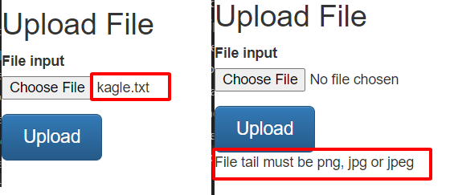
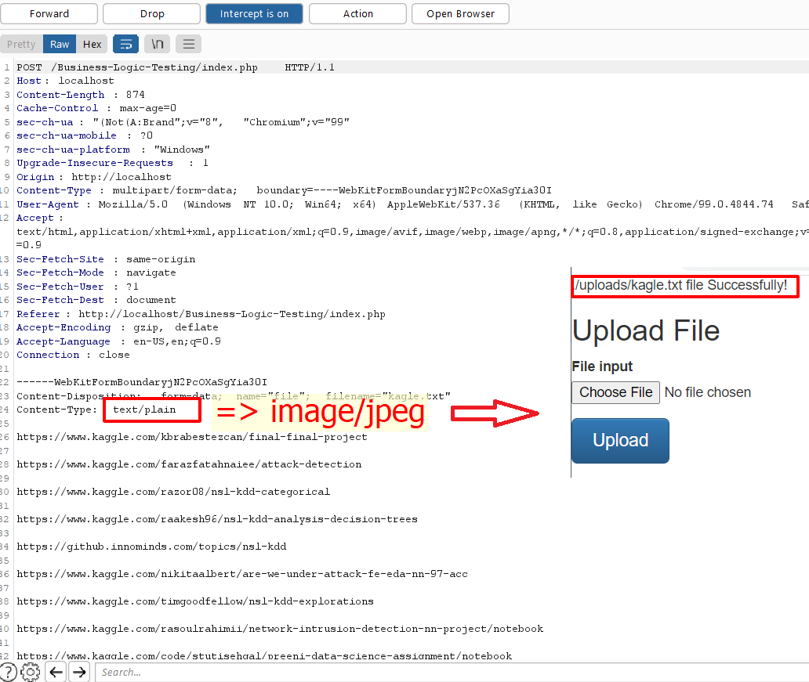

Người thực hiện: Lê Trần Văn Chương.

Thời gian: 06/05/2022.

Mục lục:
- [Test Business Logic Data Validation](#test-business-logic-data-validation)
- [Ví dụ](#ví-dụ)
  - [Ví dụ 1](#ví-dụ-1)

## Test Business Logic Data Validation
- Ứng dụng phải đảm bảo rằng chỉ dữ liệu hợp lệ về mặt logic mới có thể được nhập ở giao diện người dùng cũng như trực tiếp đến phía máy chủ của một ứng dụng hệ thống. Việc chỉ xác minh dữ liệu cục bộ có thể khiến các ứng dụng dễ bị tấn công bởi máy chủ thông qua proxy hoặc tương tác với các hệ thống khác.
- Việc kiểm tra các lỗi logic nghiệp vụ trong một ứng dụng web động đa chức năng đòi hỏi phải suy nghĩ theo các phương pháp độc đáo. Nếu cơ chế xác thực của ứng dụng được phát triển với mục đích thực hiện các bước 1, 2, 3 theo thứ tự cụ thể đó để xác thực người dùng. Điều gì xảy ra nếu người dùng chuyển thẳng từ bước 1 sang bước 3?

## Ví dụ
### Ví dụ 1
- Tôi sử dụng chức năng upload sau. Chức năng này chỉ cho phép người dùng upload các file có phần mở rộng là `png`, `jpg`, `jpeg` tức phải là hình ảnh mới được upload, còn những file khác thì không được (hình bên dưới).

-Bây giờ, tôi sử dụng `Burp Suite` để có thể lấy được phần header và sửa lại phần `context-type` và kết quả như hình dưới.
