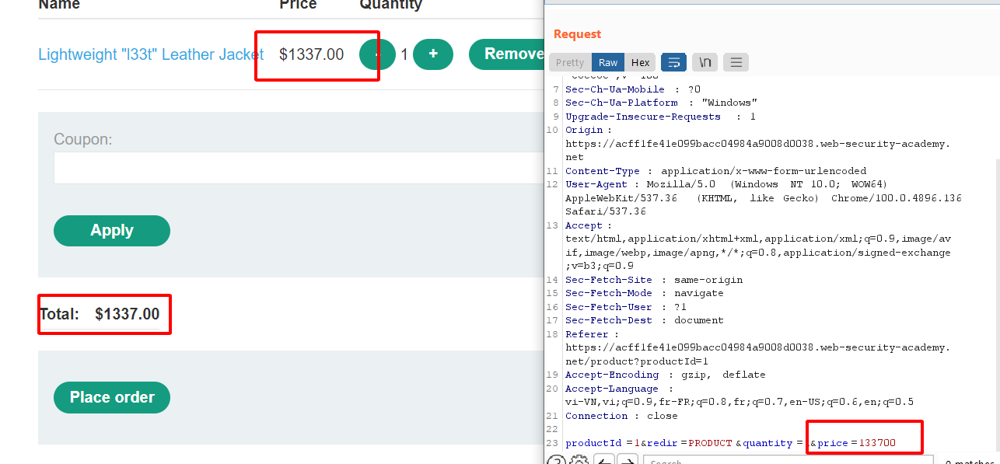

Người thực hiện: Lê Trần Văn Chương.

Thời gian: 06/05/2022.

Mục lục:
- [Test Business Logic Data Validation](#test-business-logic-data-validation)
- [Ví dụ](#ví-dụ)
  - [Ví dụ 1](#ví-dụ-1)
  - [Ví dụ 2](#ví-dụ-2)
  - [Ví dụ 3](#ví-dụ-3)

## Test Business Logic Data Validation
- Business Logic xảy ra khi một ứng dụng (trang web, ứng dụng dành cho thiết bị di động, dịch vụ web…) không hoạt động như mong đợi.
- Nó xảy ra khi một số bước logic hoặc một quy trình làm việc có thể bị kẻ tấn công tránh, phá vỡ hoặc thao túng. Kẻ tấn công chuyển hướng quy trình làm việc vì lợi ích riêng của nó, bản thân nó không phải là một sai lầm kỹ thuật.
- Các lỗi logic nghiệp vụ thường có thể được khai thác mà không có các công cụ kỹ thuật cụ thể, đôi khi chỉ đơn giản bằng cách thao tác với url hoặc mã htlm của trang.

## Ví dụ
### Ví dụ 1
- Tôi sử dụng chức năng upload sau. Chức năng này chỉ cho phép người dùng upload các file có phần mở rộng là `png`, `jpg`, `jpeg` tức phải là hình ảnh mới được upload, còn những file khác thì không được (hình bên dưới).

-Bây giờ, tôi sử dụng `Burp Suite` để có thể lấy được phần header và sửa lại phần `context-type` và kết quả như hình dưới.

### Ví dụ 2
- Ví dụ này sẽ là ví dụ về việc chuyển tiền. Bình thường, người gửi sẽ gửi số tiền cho người khác bằng cách nhập số tài khoản ngân hàng và gửi. Để đơn giản hơn tôi sẽ cho người dùng nhập tên người nhận và số tiền như hình bên dưới.

- Sẽ như thế nào? Nếu tôi thay vì không truyền vào số nguyên dương và thay vào đó sẽ là số nguyên âm (hình bên dưới).

### Ví dụ 3
- Ví dụ này sẽ là thanh toán 1 đơn hàng. 
- Giả sử bạn mua 1 món hàng với giá `$1337.00` như hình bên dưới. 

- Tôi sử dụng `Burp Suite` để lấy `request` này sau đó dùng chức năng `Repeater` để thay đổi số tiền thanh toán thành `$1.00` và kết quả (hình dưới). Tôi có thể mua 1 món hàng với giá trên $1000.00 chỉ với $1 trong tay.

